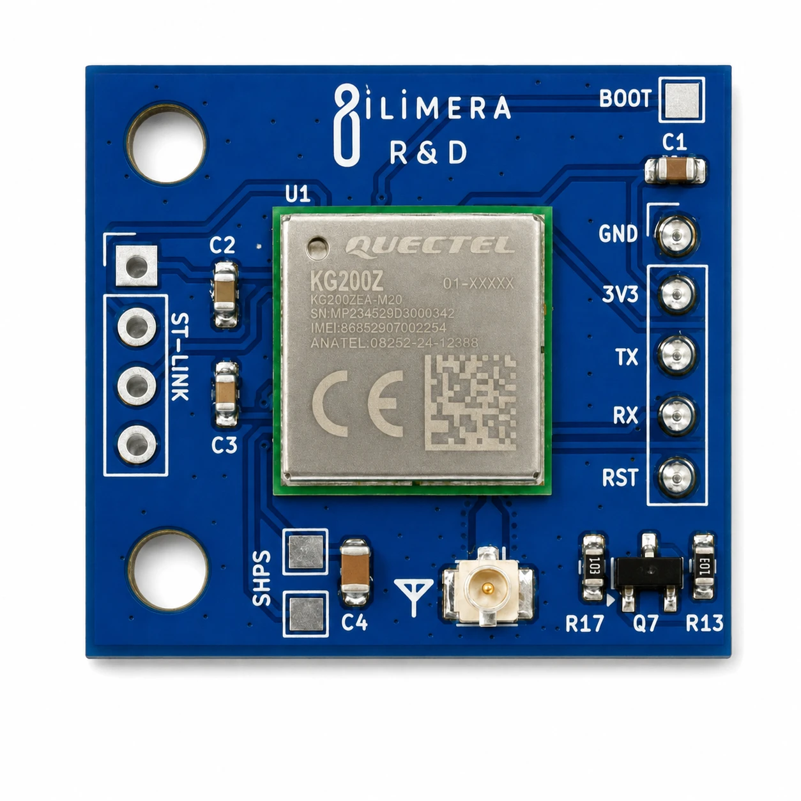

# KG200Z LoRaWAN Devboard

[Türkçe](README.md) · [Product page](https://ilimera.com/en/urunler/gelistirme-kartlari/lorawan-devboard) · [Technical document (PDF, Turkish)](docs/KG200Z_LoRaWAN_teknik_dokuman_v1.pdf)

The İLİMERA KG200Z LoRaWAN Devboard brings the **Quectel KG200Z** module to a 25 × 22 mm breakout board. With its
STM32WL-based ARM Cortex-M4 core and ready LoRaWAN stack it adds long-range connectivity over UART to sensor
nodes, smart agriculture, industrial telemetry and remote monitoring projects.

## Specifications

| Feature | Value |
| --- | --- |
| Module | Quectel KG200Z (STM32WL, 48 MHz ARM Cortex-M4, 256 KB Flash, 64 KB RAM) |
| Protocol | LoRaWAN 1.0.3, Class A / B / C |
| Modulation | LoRa, (G)FSK, (G)MSK, BPSK |
| Frequency | 470–510 MHz / 863–928 MHz (EU868, US915, AS923…) |
| TX power / RX sensitivity | 20 dBm typical / −136 dBm (BW 125 kHz, SF12) |
| Interface | UART, AT commands |
| Power | 1.8–3.6 V (3.3 V typical), at least 0.5 A |
| Logic level | 3.3 V (**not 5 V tolerant**) |
| Antenna | U.FL/IPEX, 50 Ω |
| Programming / debug | ST-LINK/SWD (SWDIO, SCK), BOOT, UART bootloader |
| Operating temperature | −40 °C … +85 °C |
| Size | 25 × 22 mm |

## Pins

| Pin | Direction | Description |
| --- | --- | --- |
| 3V3 | Power in | Stable, clean 3.3 V; current rises during RF transmission |
| GND | — | Common ground |
| TX | Output | To the controller **RX** |
| RX | Input | To the controller **TX** (3.3 V) |
| RST | Input | Active-low hardware reset |
| SWDIO, SCK | — | ST-LINK/SWD flashing and debugging |
| BOOT | Input | Enter the UART bootloader |

## Important

- **Never transmit without an antenna.** It can permanently damage the RF output stage. Use a 50 Ω antenna for
  your region (868 MHz for Europe/Türkiye).
- **3.3 V logic.** With 5 V controllers (Arduino Uno/Mega) always add a **level shifter** on TX/RX.
- **Antenna placement.** Prefer plastic/ABS enclosures and keep the antenna at least 5 cm from metal surfaces.

## Quick start

1. Attach the antenna to the U.FL connector.
2. Wire the board to a 3.3 V controller: board TX → controller RX, board RX → controller TX, common GND.
3. Upload [`examples/01_AT_Komut_Terminali`](examples/01_AT_Komut_Terminali) to an ESP32.
4. Open the Serial Monitor at **115200 baud, Both NL & CR**. The sketch detects the module's baud rate
   (115200 / 9600), prints `ATI` and `AT+CGMR`, then passes your commands through.

## Examples

| Example | What it does |
| --- | --- |
| [01_AT_Komut_Terminali](examples/01_AT_Komut_Terminali) | AT terminal from the Serial Monitor with automatic baud detection and a clean RST start |

## Resources and support

- Manufacturer page and documents: [Quectel KG200Z](https://www.quectel.com/product/lora-kg200z/)
- The Things Stack device registration: [Quectel KG200Z](https://www.thethingsindustries.com/docs/hardware/devices/models/quectel-kg200z/)
- Documentation, updates and support: [ilimera.com](https://ilimera.com/en/urunler/gelistirme-kartlari/lorawan-devboard)
- Open an **Issue** in this repository for bugs and suggestions.

KG200Z LoRaWAN Devboard is developed by İLİMERA Technology. Quectel and KG200Z are trademarks of Quectel Wireless
Solutions.

## License

The example code is provided under the [MIT License](LICENSE); you are free to use it in your own products.
Technical documents and images are the property of İLİMERA Technology.
