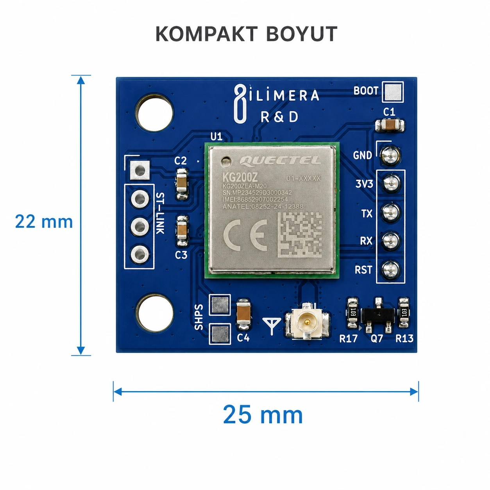

# KG200Z LoRaWAN Devboard

[English](README.en.md) · [Ürün sayfası](https://ilimera.com/urunler/gelistirme-kartlari/lorawan-devboard) · [Teknik doküman (PDF)](docs/KG200Z_LoRaWAN_teknik_dokuman_v1.pdf)

İLİMERA KG200Z LoRaWAN Devboard, **Quectel KG200Z** modülünü 25 × 22 mm'lik bir breakout kartında sunar.
STM32WL tabanlı ARM Cortex-M4 çekirdeği ve hazır LoRaWAN yığınıyla sensör düğümleri, akıllı tarım, endüstriyel
telemetri ve uzaktan izleme projelerine UART üzerinden eklenir.

## Teknik özellikler

| Özellik | Değer |
| --- | --- |
| Modül | Quectel KG200Z (STM32WL, 48 MHz ARM Cortex-M4, 256 KB Flash, 64 KB RAM) |
| Protokol | LoRaWAN 1.0.3, Class A / B / C |
| Modülasyon | LoRa, (G)FSK, (G)MSK, BPSK |
| Frekans | 470–510 MHz / 863–928 MHz (EU868, US915, AS923…) |
| TX gücü / RX hassasiyeti | 20 dBm tipik / −136 dBm (BW 125 kHz, SF12) |
| Arayüz | UART, AT komutları |
| Besleme | 1.8–3.6 V (tipik 3.3 V), en az 0.5 A |
| Lojik seviye | 3.3 V (**5 V toleranslı değil**) |
| Anten | U.FL/IPEX, 50 Ω |
| Programlama / debug | ST-LINK/SWD (SWDIO, SCK), BOOT, UART bootloader |
| Çalışma sıcaklığı | −40 °C … +85 °C |
| Boyut | 25 × 22 mm |

## Pinler

| Pin | Yön | Açıklama |
| --- | --- | --- |
| 3V3 | Güç girişi | Kararlı, parazitsiz 3.3 V; RF iletim sırasında akım artar |
| GND | — | Ortak toprak |
| TX | Çıkış | Denetleyicinin **RX**'ine |
| RX | Giriş | Denetleyicinin **TX**'ine (3.3 V) |
| RST | Giriş | Aktif-düşük donanım resetı |
| SWDIO, SCK | — | ST-LINK/SWD ile yazılım yükleme ve hata ayıklama |
| BOOT | Giriş | UART bootloader'a girmek için |

## Önemli uyarılar

- **Antensiz gönderim yapmayın.** Anten takılı değilken RF iletimi modülün çıkış katına kalıcı zarar verebilir.
  Bölgenize uygun frekansta (Türkiye/Avrupa için 868 MHz) 50 Ω bir anten kullanın.
- **3.3 V lojik.** Arduino Uno/Mega gibi 5 V denetleyicilerde TX/RX'e mutlaka **seviye dönüştürücü** ekleyin.
- **Anten yerleşimi.** Metal yerine plastik/ABS kutu kullanın, anteni metal yüzeylerden en az 5 cm uzak tutun.

## Hızlı başlangıç

1. Anteni U.FL konnektörüne takın.
2. Kartı 3.3 V'luk bir denetleyiciye bağlayın: kart TX → denetleyici RX, kart RX → denetleyici TX, GND ortak.
3. [`examples/01_AT_Komut_Terminali`](examples/01_AT_Komut_Terminali) örneğini bir ESP32'ye yükleyin.
4. Seri Monitörü **115200 baud, Both NL & CR** ile açın. Örnek modülün seri hızını (115200 / 9600) kendisi
   bulur, `ATI` ve `AT+CGMR` cevaplarını yazar; ardından komutları doğrudan yazabilirsiniz.

## Örnekler

| Örnek | Ne yapar |
| --- | --- |
| [01_AT_Komut_Terminali](examples/01_AT_Komut_Terminali) | Seri Monitörden modüle AT komutu gönderin; seri hızı otomatik bulur, modülü RST ile temiz başlatır |

## Kaynaklar ve destek

- Üretici sayfası ve belgeleri: [Quectel KG200Z](https://www.quectel.com/product/lora-kg200z/)
- The Things Network / The Things Stack cihaz kaydı: [Quectel KG200Z](https://www.thethingsindustries.com/docs/hardware/devices/models/quectel-kg200z/)
- Teknik doküman, güncellemeler ve destek: [ilimera.com](https://ilimera.com/urunler/gelistirme-kartlari/lorawan-devboard)
- Hata bildirimi ve öneriler için bu depoda **Issue** açabilirsiniz.

KG200Z LoRaWAN Devboard, İLİMERA Teknoloji tarafından geliştirilmiştir. Quectel ve KG200Z, Quectel Wireless
Solutions'ın ticari markalarıdır.

## Lisans

Örnek kodlar [MIT lisansı](LICENSE) ile sunulur; kendi ürünlerinizde serbestçe kullanabilirsiniz.
Teknik dokümanlar ve görseller İLİMERA Teknoloji'ye aittir.
